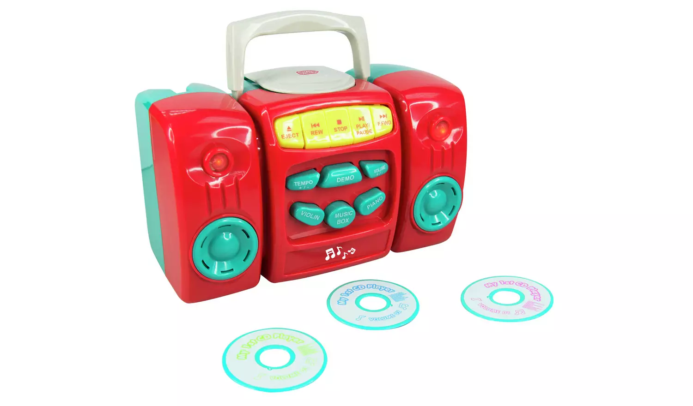

# HackedChadValleyMy-FirstCDPlayer
Hacked Chad Valley My First CD Player

## Background

[Chad Valley My First CD Player - Argos product: 349/8420](https://www.argos.co.uk/product/3498420)



## Overview

### Idea

Repurpose as a Toniebox style player based on [MiczFlor/RPi-Jukebox-RFID](https://github.com/MiczFlor/RPi-Jukebox-RFID)

### Teardown

Once taken apart there is a circuit board.


| Item          | Connection A | Connection B | High/Low | Notes                                          |
| ------------- | ------------ | ------------ | -------- | ---------------------------------------------- |
| Backward      | BP05         | BP22         |          |                                                |
| Stop          | BP05         | BP20         |          |                                                |
| Play          | BP05         | BP23         |          |                                                |
| Forward       | BP05         | BP21         |          |                                                |
| Temp+/-       | BP04         | BP23         |          |                                                |
| Volume+/-     | BP04         | BP20         |          |                                                |
| DEMO          | BP05         | BP26         |          |                                                |
| Guitar/Violin | BP03         | BP25         |          | Labeled as Guitar on PCB but Violin on Outside |
| Music Box     | BP03         | BP26         |          |                                                |
| Piano         | BP03         | BP23         |          |                                                |
| LED           | BP03         | BP04         |          |                                                |
| CD Tray       | VSS          | S01/BP14     |          | Separate PCB on CD Tray                        |
| CD Tray       | VSS          | S02/BP15     |          | Separate PCB on CD Tray                        |


| Point | Notes                |
| ----- | -------------------- |
| VSS   | Used by CD Tray      |
| BP03  | VSS?                 |
| BP04  | Active when playing? |
| BP05  | VSS?                 |
| BP14  |                      |
| BP15  |                      |
| BP20  |                      |
| BP21  |                      |
| BP22  |                      |
| BP23  |                      |
| BP25  |                      |
| BP26  |                      |

## Install

Fresh buster - raspi lite [Buster Raspi Lite](https://downloads.raspberrypi.org/raspios_lite_armhf/images/raspios_lite_armhf-2021-05-28/2021-05-07-raspios-buster-armhf-lite.zip)

```bash
add ssh file
add wpa

add ipv6.disable=1 to end of /boot/cmdline.txt

logoin
add ssh key
sudo raspi-config expand fs
set gpu to 64MB
sudo raspi-config nonint do_hostname musicbox
reboot
sudo apt update
sudo apt upgrade -y
sudo apt install python3-evdev -y
cd; rm buster-install-*; wget https://raw.githubusercontent.com/MiczFlor/RPi-Jukebox-RFID/master/scripts/installscripts/buster-install-default.sh; chmod +x buster-install-default.sh; ./buster-install-default.sh
cd; rm buster-install-*; wget https://raw.githubusercontent.com/MiczFlor/RPi-Jukebox-RFID/develop/scripts/installscripts/buster-install-default.sh; chmod +x buster-install-default.sh; GIT_BRANCH=develop bash ./buster-install-default.sh

sudo apt autoremove -y

```


setup adudio out
 on pi zero [pizero dts audio pwm](https://learn.adafruit.com/adding-basic-audio-ouput-to-raspberry-pi-zero/pi-zero-pwm-audio)

 Here's two DTO options that people have written in to suggest. The first uses a DTO that was recently added it seems:

There is a much simpler way to configure the Pi GPIO pins for PWM audio. Simply adding the following line to your /boot/config.txt will reconfigure the pins at boot without any external software or services: dtoverlay=pwm-2chan,pin=18,func=2,pin2=13,func2=4
Or, you can craft your own DTO

Hi, I got the pwm audio working on my pi-zero, with an dtoverlay: https://hackaday.io/project/9467-pigrrl-zero/log/35090-pi-zero-pwm-audio-device-tree-overlay
Either way, if you use a DTO you can skip down to the low pass wiring section

https://gist.github.com/damoclark/ab3d700aafa140efb97e510650d9b1be

Force audio via 3.5mm jack
```bash
sudo raspi-config nonint do_audio 1
```

### Low Pass Filter Wiring

Now wire up the schematic to GPIO #13 as PWM1 and #18 PWM0 on a breadboard. You can skip the diodes. If you don't have the exact values it's ok. I built it with a 10nF capacitor (0.01uF) rather than 33nF and it worked just fine (the cutoff frequency is higher but the speakers dont hear those high frequencies anyways)


wget https://project-downloads.drogon.net/wiringpi-latest.deb
sudo dpkg -i wiringpi-latest.deb

add to /boot/config.txt

dt_overlay=audremap,pins_18_19=on